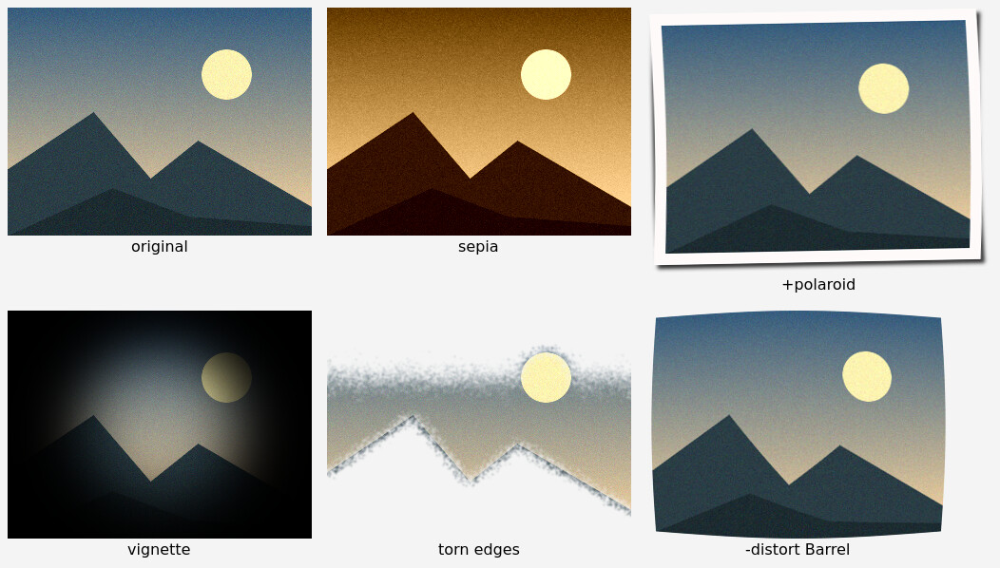
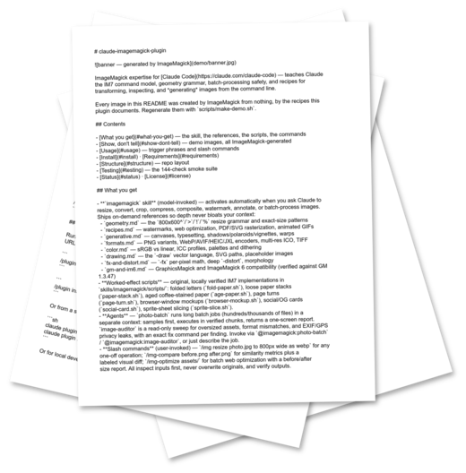

# claude-imagemagick-plugin


ImageMagick expertise for [Claude Code](https://claude.com/claude-code) — teaches Claude the IM7 command model, geometry grammar, batch-processing safety, and recipes for transforming, inspecting, and *generating* images from the command line.

Every image in this README was created by ImageMagick from nothing, by the recipes this plugin documents. Regenerate them with `scripts/make-demo.sh`.

## Contents

- [What you get](#what-you-get) — the skill, the references, the scripts, the commands
- [Show, don't tell](#show-dont-tell) — demo images, all ImageMagick-generated
- [Usage](#usage) — trigger phrases and slash commands
- [Install](#install) · [Requirements](#requirements)
- [Structure](#structure) — repo layout
- [Testing](#testing) — the 144-check smoke suite
- [Status](#status) · [License](#license)

## What you get

- **`imagemagick` skill** (model-invoked) — activates automatically when you ask Claude to resize, convert, crop, compress, composite, watermark, annotate, or batch-process images. Ships on-demand references so depth never bloats your context:
  - `geometry.md` — the `800x600^`/`>`/`!`/`%` resize grammar and exact-size patterns
  - `recipes.md` — watermarks, web optimization, PDF/SVG rasterization, animated GIFs
  - `generative.md` — canvases, typesetting, shadows/polaroids/vignettes, warps
  - `formats.md` — PNG variants, WebP/AVIF/HEIC/JXL encoders, multi-res ICO, TIFF
  - `color.md` — sRGB vs linear, ICC profiles, palettes and dithering
  - `drawing.md` — the `-draw` vector language, SVG paths, placeholder images
  - `fx-and-distort.md` — `-fx` per-pixel math, deep `-distort`, morphology
  - `gm-and-im6.md` — GraphicsMagick and ImageMagick 6 compatibility (verified against GM 1.3.47)
- **Worked-effect scripts** — original, locally verified IM7 implementations in `skills/imagemagick/scripts/`: folded letters (`fold-paper.sh`), loose paper stacks (`paper-stack.sh`), aged coffee-stained paper (`age-paper.sh`), page turns (`page-turn.sh`), browser-window mockups (`browser-mockup.sh`), social/OG cards (`social-card.sh`), sprite-sheet slicing (`sprite-slice.sh`).
- **Agents** — `photo-batch` runs long batch jobs (hundreds/thousands of files) in a separate context: samples first, executes in verified chunks, returns a one-screen report. `image-auditor` is a read-only sweep for oversized assets, format mismatches, and EXIF/GPS privacy leaks, with an exact fix command per finding. Invoke via `@imagemagick:photo-batch` / `@imagemagick:image-auditor`, or just describe the job.
- **Slash commands** (user-invoked) — `/img resize photo.jpg to 800px wide as webp` for any one-off operation; `/img-compare before.png after.png` for similarity metrics plus a labeled visual diff; `/img-optimize assets/` for batch web optimization with a before/after size report. All inspect inputs first, never overwrite originals, and verify outputs.

## Show, don't tell

One synthesized scene (sky, sun, and mountains drawn from primitives — no input file), run through recipes from `generative.md`:



And the flagship worked example, `skills/imagemagick/scripts/paper-stack.sh` — the README you are reading right now, typeset into letter pages and photographed as a loose stack (yes, this image contains this sentence):



## Usage

Just ask — the skill triggers on natural phrasing:

> convert hero.png to webp<br>
> make this image smaller<br>
> put a watermark saying DRAFT on every jpg in this folder<br>
> render this .txt file as a folded letter photo

Or invoke it explicitly:

```
/img crop scan.png to the top-left 600x400 region as a png
```

## Install

Run these **one at a time** — pasting both lines as a single prompt mangles the marketplace URL:

```
/plugin marketplace add MarkusBitterman/claude-imagemagick-plugin
```

```
/plugin install imagemagick
```

Or from a shell, outside any session:

```sh
claude plugin marketplace add MarkusBitterman/claude-imagemagick-plugin
claude plugin install imagemagick
```

Or for local development:

```sh
claude --plugin-dir /path/to/claude-imagemagick-plugin
```

### Requirements

- **ImageMagick 7** (`magick` binary) — v6 and GraphicsMagick are handled with reduced coverage via the compatibility reference
- Ghostscript, only for PDF/PostScript input
- ffmpeg is out of scope: video→GIF requests get pointed there

## Structure

Modeled on the official [example-plugin](https://github.com/anthropics/claude-plugins-official/tree/main/plugins/example-plugin):

```
.claude-plugin/plugin.json      plugin metadata
.claude-plugin/marketplace.json direct-install support
skills/imagemagick/             model-invoked skill + references/ + scripts/
skills/img*/                    /img, /img-compare, /img-optimize commands
agents/                         photo-batch, image-auditor subagents
scripts/verify-recipes.sh       smoke test: every documented command vs. fixtures
scripts/make-demo.sh            regenerates the README demo images
test-images/                    tiny PNG/JPEG/GIF/SVG fixtures
demo/                           README images (ImageMagick-generated)
CLAUDE.md                       contributor guidance
TODO.md                         roadmap
```

## Testing

```sh
scripts/verify-recipes.sh                                          # 80 checks
nix shell nixpkgs#ghostscript --command scripts/verify-recipes.sh  # + PDF/PS cases
```

Every command documented in the skill has been verified against ImageMagick 7.1.2 (Q16-HDRI), and the GraphicsMagick compatibility claims against GM 1.3.47.

## Status

v0.2 — verified and hardened. See [TODO.md](TODO.md) for the roadmap.

## License

[Apache-2.0](LICENSE)
